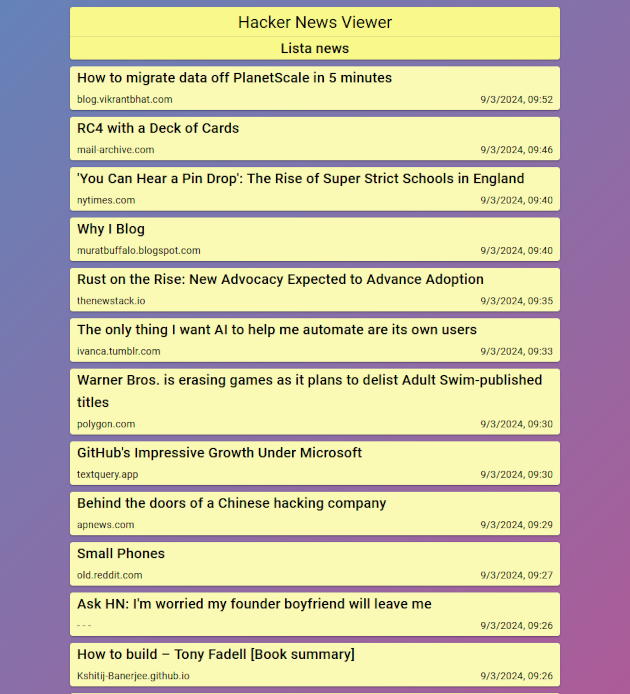

# Angual Hacker News Viewer
Applicazione Angular che si connette al servizio Hacker News e ne riporta le notizie. 
All'apertura l'applicazione si connette alle API del servizio e riporta le prime 10 notizie, per caricarne altre premere il pulsante in fondo alla pagina. 
Cliccando sulla scheda della notizia si accede al sito della stessa. 

> [!TIP] 
> Cliccando su tutta la scheda della notizia si potrà accedere al sito della notizia mentre cliccando sull'url in basso a sinistra si avrà accesso al dominio principale del sito che riporta la notizia. 

> [!IMPORTANT]
> L'API Hacker News restiruisce 500 notizie.  
> Una volta visualizzate tutte le riscarica e ricomincia il ciclo. 

### Test
Per provare l'applicazione bisogna aver installati sul proprio sistema:
 - node.js
 - npm
 - Angular CLI

Una volta installati node.js, npm e Angular CLI portarsi nella cartella del repository e lanciare i seguenti comandi da terminale:
 - npm install (Installa le dipendenze)
 - ng serve (Avvia l'applicazione in locale)

 > [!NOTE]
 > É possibile provare l'applicazione senza scaricare nulla sul proprio sistema al seguente link: 
 > [Haker News Viewer Angular](https://hacker-news-viewer-angul-979f2.web.app)
